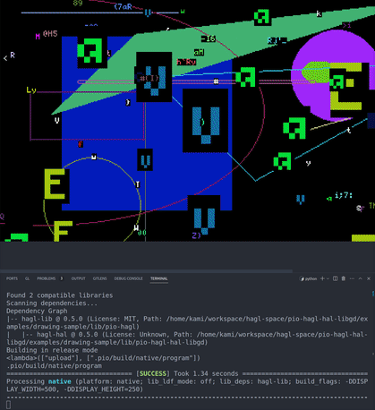

# Drawing Sample

To run this sample, you will have to have PlatformIO installed and configured.

```pwsh
cd drawing-sample
platformio run --target upload --environment native -vvv
```

A file called [hagl.bmp] is overwritten on every run.\
This path can be overridden via build flags in [platformio.ini].\
\
**Have fun!**



[platformio.ini]: ./drawing-sample/platformio.ini
[hagl.bmp]: ./drawing-sample/hagl.bmp